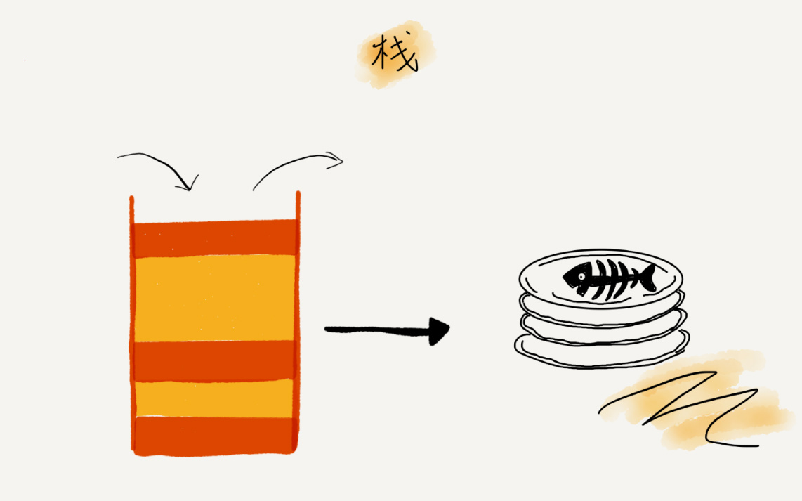

# 栈

栈（stack）是一种 “操作受限” 的线性表数据结构，只允许在一端插入（push，入栈）和删除（pop，出栈）数据。

因此，栈有 `先进后出，后进先出` 的特性。如图：



栈可以通过 `数组` 和 `链表` 来实现，分为两类：

* `顺序栈`：用数组实现
* `链式栈`：用链表实现

所以内存使用上，既可以是连续的内存空间，又可以是零散的内存块。

## 一、基于数组实现的栈（顺序栈）

代码如下：

```java
// 基于数组实现的顺序栈
public class ArrayStack {
    private String[] items;  // 数组
    private int n; // 栈的大小
    private int count; // 栈中元素个数

    // 构造函数
    public ArrayStack(int n) {
        this.items = new String[n];
        this.n = n;
        this.count = 0;
    }

    // 入栈
    public boolean push(String item) {
        if (count == n) return false; // 栈已满，空间不够，入栈失败
        items[count] = item;
        ++count;
        return true;
    }
  
    // 出栈
    public String pop() {
        if (count == 0) return null; // 栈为空，返回 null
        String item = items[count-1];
        --count;
        return item;
    }
}
```

可以分析出，入栈和出栈的时间复杂度为 `O(1)`

## 二、栈的实际应用

栈在软件工程和实际开发中有很多应用，如：`函数调用栈`、`表达式求值`、`检查表达式括号是否匹配`、`浏览器前进、后退`。

### 2.1 函数调用栈

操作系统会为每一个线程分配一块独立的内存空间，这些内存空间被组织成 `栈` 的结构。

在代码执行过程中，编译器为了管理函数与函数之间的调用关系，就需要用到栈，即 `函数调用栈`。

当一个函数执行时，会将函数的相关变量压入栈，执行结束后，又出栈。

如函数 main 调用了另一个函数 add，那么得等 函数 add 执行完了，函数 main 才能执行完。

所以让函数 main 先进栈，函数 add 再进栈，这样等函数 add 执行结束出栈了，函数 main 才能出栈，这样就表现了函数之间的调用关系。


### 2.2 表达式求值

编译器如何利用栈来实现表达式求值呢？比如 `3+5*8-6` 。

编译器是采用了两个栈而实现的，一个栈（左栈）存储操作数，一个栈（右栈）存储运算符，具体过程如下：

```
1. 从左往右遍历表达式，操作数入左栈，运算符入右栈。
2. 当遇到运算符时，会将此运算符与右栈的栈顶运算符，进行优先级比较。
3. 若此运算符优先级高，则入右栈
4. 若此运算符优先级低，则从右栈中取出两个数，从左栈取出栈顶的运算符，进行运算后，结果压入左栈，再将此运算符压入右栈。
5. 最后遍历结束，得到最后的结果，清空两个栈。
```

### 2.3 检查表达式括号是否匹配

如何检查括号是否匹配，如 `圆括号 ()`、`中括号 []`、`花括号 {}` ，以及它们之间的任意嵌套（如 `{[()]}`、`({[]})` ）呢？

可以用一个栈来实现，具体如下：

```
1. 从左往右遍历表达式。
2. 若遇到左括号，则将其压入栈。
3. 若遇到右括号，则取出栈顶的左括号，比较是否是成对的左右括号，是则继续遍历，否则检查出不匹配。
```

### 2.4 浏览器前进、后退

当我们通过浏览器的同一个标签页，查看了多个网页后，如顺序 `a-b-c`，当前在 `c`。

那么我们能在 `c`，通过点击后退按钮，回到 `b`，再点一次，就回到了 `a`。

在 `a` 点击前进按钮，能回到 `b`，再点击一次，又能回到 `c` 。

如果在 `b` 时，访问了新的网页 `d` ，那么此时就不能回到 `c` 了，只能在 `a-b-d` 之间切换。

这如何实现呢？

实际上，也是通过两个栈实现的，一个栈（左栈）存储当前网页和之前的网页，一个栈（右栈）存储之后的网页。具体如下：

```
1. 当访问 a-b-c 时，a、b、c 依次入左栈。
2. 从 c 后退到 b 时，c 出左栈，入右栈。
3. 从 b 前进到 c 时，c 出右栈，入左栈。
4. 当在 b 访问 d 时，d 入左栈，右栈清空
```

这样右栈为空的情况下，前进按钮就不能点击了。