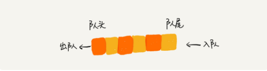

# 队列

队列（queue）是一种 “操作受限” 的线性表数据结构，只允许在一端插入数据（enqueue，入队），另一端删除数据（dequeue，出队）。

因此，队列有 `先进先出，后进后出` 的特性，像排队一样，从队尾入队，从队头出队。如图：



队列和栈一样都是 “操作受限” 的线性表数据结构，只是受限的操作不一样，都属于抽象的数据结构。

队列也可以通过 `数组` 和 `链表` 来实现，分为两类：

* `顺序队列`：基于数组实现
* `链式队列`：基于链表实现

所以内存使用上，既可以是连续的内存空间，又可以是零散的内存块。

## 一、基于数组实现的队列（顺序队列）

代码示例如下：

```java
// 基于数组实现的顺序队列
public class ArrayQueue{
    private String[] items; // 数组
    private int n; // 队列的大小
    private int head; // 队头指针
    private int foot; // 队尾指针

    // 构造函数
    public ArrayQueue(int n){
        this.items = new String[n];
        this.n = n;
        this.head = 0;
        this.foot = 0;
    }

    // 入队
    private boolean enqueue(String item){
        if(foot == n) return false; // 队列已满，空间不够，入队失败
        items[foot] = item;
        ++foot;
        return true;
    }

    // 出队
    private String dequeue(){
        if(head==foot) return null; // 队列为空，返回 null
        String temp = items[head];
        ++head;
        return temp;
    }
}
```